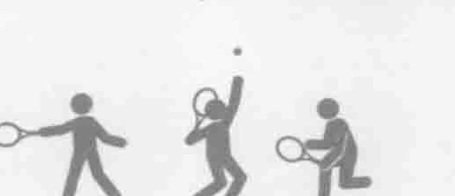
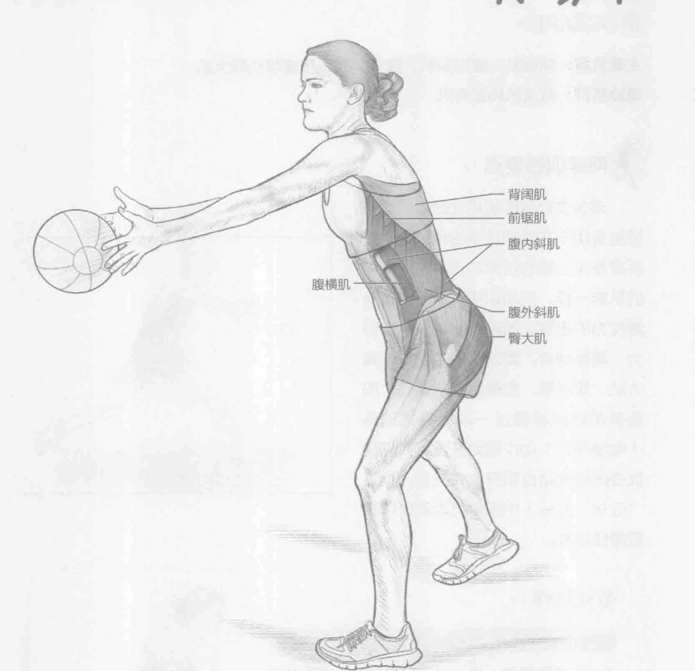
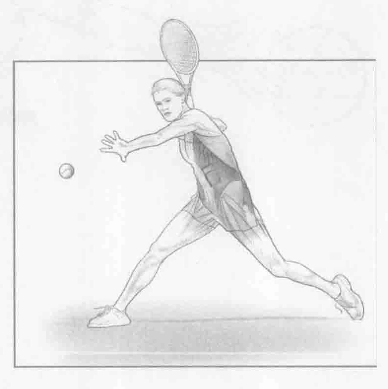
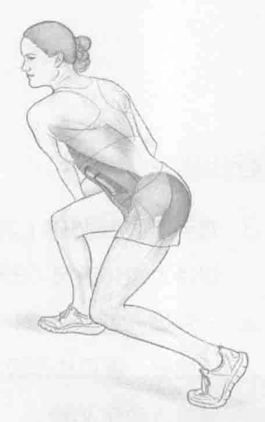

### 进行步骤

1. 双手持重4到6磅（2到3千克）的健身实心球站立。面向搭档或墙壁并与之保持大约10英尺（3米）的距离。

2. 一只脚向前踏一步，使身体保持侧面站立姿势。将健身实心球投掷给搭档或墙壁。该项动作模拟正手击球的平行式站位。

3. 重复该动作30秒。

### 参与的肌肉

主要肌群：前锯肌、腹内斜肌、腹外斜肌、腹横肌和醫大肌

辅助肌群：背阔肌和竖脊肌

### 网球训练要点

健身实心球的使用让此力量训练特别适用于实际的正手击球动作。正手健身实心球的投掷与正手击球调用的肌群一样。该项训练有助于形成有爆发力的击球，同时也能增强肌肉耐力。具体地讲，髋部和核心部位（臀大肌、腹斜肌、腹横肌和前锯肌）的旋转肌群能够通过一项增强式训练（收缩循环）动作得到开发。我们建议在闭合式站位和开放式站位（参见“变化”部分）中练习此项动作以获取最佳效果。

### 变化动作

#### 开放式站位的正手健身实心球投掷

不用左脚向前踏一步（对于习惯用右手打球的运动员而言），站立在起始位置，以正面向前的方式投掷健身实心球。这是一项更高级的训练。由于该动作不使用腿部和向前重心转移，因此该项训练更着重于人体核心部位肌群的训练。
