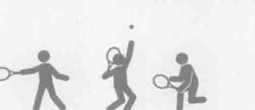
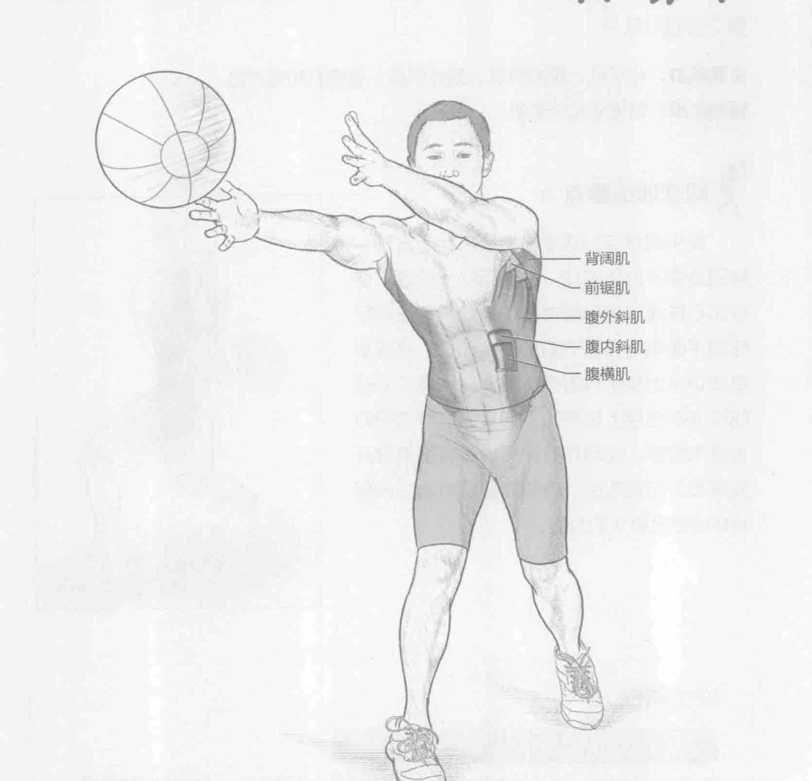
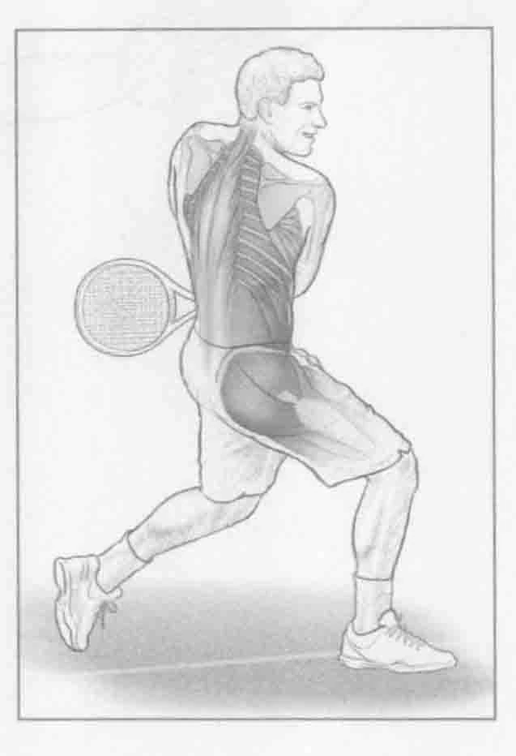

### 进行步骤

1. 双手持重4到6磅（2到3千克）的健身实心球站立。面向搭档或墙壁并与之保持大约10英尺（约3米）的距离。

2. 一只脚向前踏一步，使身体保持侧面站立姿势。将健身实心球投掷给搭档或墙壁。该项动作模拟反手击球。

3. 重复该动作30秒。

### 参与的肌肉

主要肌群：背阔肌、腹内斜肌、腹外斜肌、腹橫肌和臀大肌

辅助肌群：前锯肌和竖脊肌

### 网球训练要点

反手健身实心球准确地模拟反手击球，特别是双手反手击球，并使用同一肌群。健身实心球通过增加阻力和使运动员专注稳定性和平衡来增强躯干的肌肉活动性。这些都是成功击出反手球的关键要素。健身实心球的投掷在使用上半身和下半身的肌群的同时也使用腹部。此动作有助于通过腹部肌群开发爆发力和稳定性。这些腹部肌群会在击落地球时提供更大的力道。

### 变化动作

#### 开放式站位的反手健身实心球投掷

不用右脚向前踏一步（对于习惯用右手打球的运动员而言），站立在起始位置，以正面向前的方式投掷健身实心球。这是一项更高级的训练。由于该动作不使用腿部和向前重心转移，因此该项训练更着重于人体核心部位肌群的训练。
