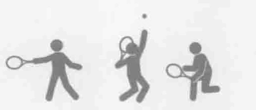
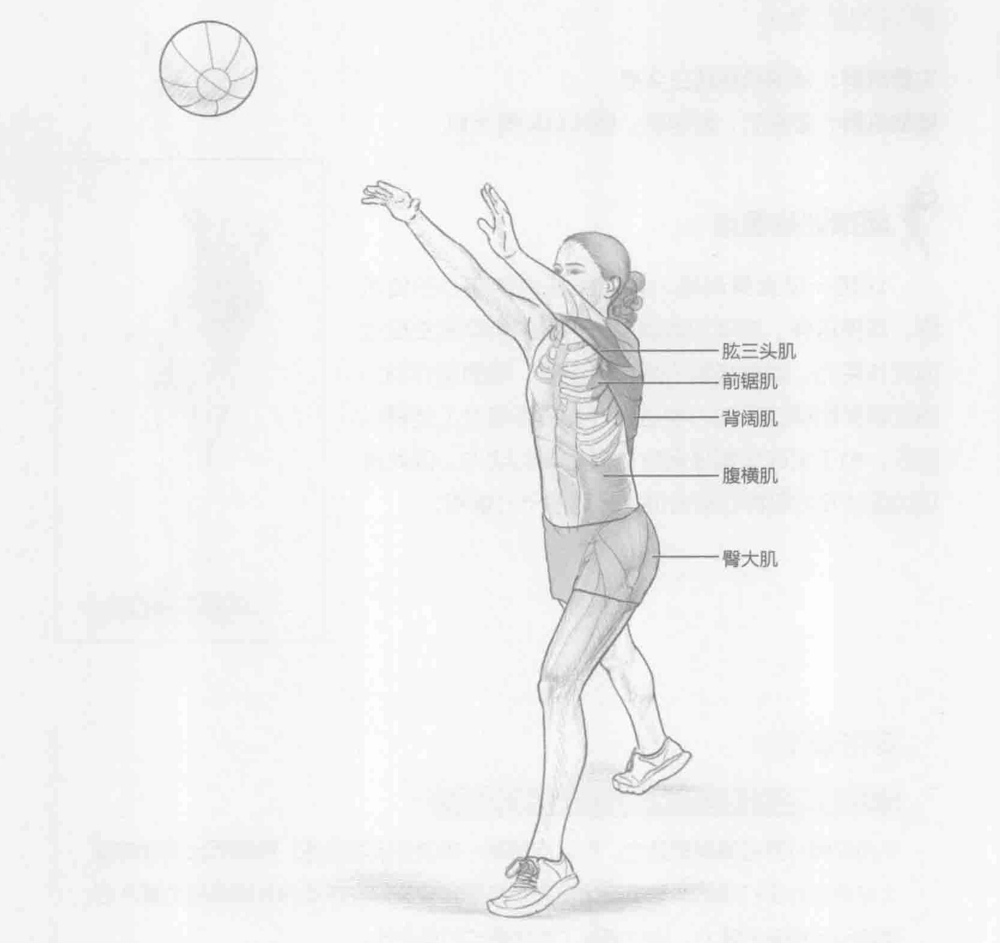
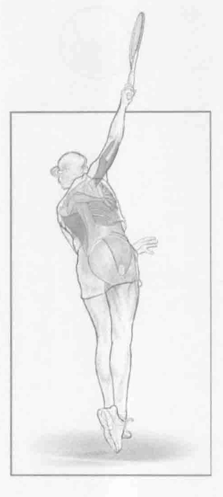

### 进行步骤

1. 双手持重4到6磅（2到3千克）的健身实心球站立。双脚分开，与肩齐宽。腹部收紧并保持稳定。面向搭档或墙壁并与之保持大约10英尺（约3米）的距离。

2. 从头顶上方将健身实心球掷出。

3. 重复该动作30秒。

### 参与的肌肉

主要肌群：背阔肌和肱三头肌

辅助肌群：腹横肌、前锯肌、竖脊肌和臀大肌

### 网球训练要点

这是一项全身训练，重点关注人体核心部位肌群。即便这样，该项训练调用下半身的肌群来生成地面反作用力。当健身实心球被掷出时，地面反作用力通过腹部肌群的运动力学链上升并最终通过上肢得以释放。由于发球大概是网球中最重要的动作，因此该项训练涉及的肌群在综合训练计划中十分重要。

### 变化动作

#### 开放式站位的发球健身实心球投掷

不用双脚分开与肩同宽站立。可以向前踏一步进行该项训练。向前迈出发球前腿（习惯用右手打球的运动员迈出左脚）来更好地模拟发球动作并锻炼将力量从后腿转移到前腿的能力。这也增加了动作模式的复杂性。
