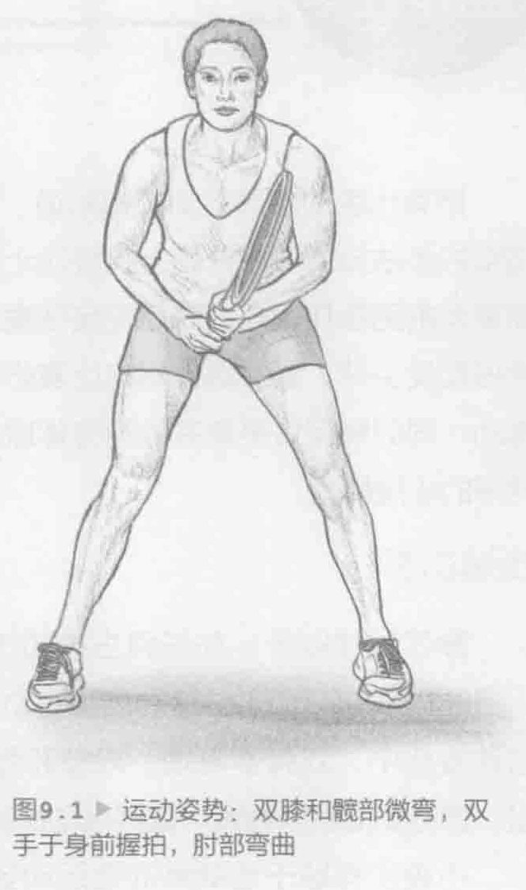

所有出色的网球运动员都知道，如果接不到球，再好的击球方法也没有用。适当的步法技巧对于球场上的成功十分重要。网球需要全方位跑动。运动员可能需要向前跑接住短球，向后跑接住高球，或者说从一侧跑向另一侧来接住离身正手球和反手球。要想赢得网球比赛必须能够在较长的一段时间内在多个方位急速跑动。同时需保持平衡并控制身体以便击球。本章中介绍的步法训练是专门针对网球的步法模式。

### 步法剖析

除了发球以外，在任何击球动作之前，运动员都需要做出良好的运动姿势（图9.1，第164页）。这种姿势有助于运动员保持平衡并快速跑向任何方位。在这种姿势中，双脚掌着地，双膝和髋部微弯，双手于身前握拍，肘部弯曲并放松。该站姿使肌肉绷紧，这样运动员就可以快速跑向下一个击球的位置。

小碎步有助于运动员准备运动姿势。在连续对打中，每次击球前运用小碎步。小碎步类似于滑雪运动员转弯时使用的减重技巧。当快速弯膝时，双脚在那一瞬间放松。落地时可以增加对地面的反作用力，让运动员能够跑向任何方向。

如果希望接住离身球，通常情况下，当运动员跳起来时，他们想要通过向球的方向进行髋关节外旋来稍微转动双脚。脚趾朝向运动员想去的地方。这样有助于运动员横向跑动。向各个方向移动的重点在于下半身的肌肉组织，特别是臀大肌、臀中肌、四头肌、腓肠肌和比目鱼肌。横向和斜向跑动除了调用上述肌群外，还需要大量调用外展肌和内收肌。

### 击球和步法

保持适当的运动姿势有助于运动员保持平衡和站姿，并让运动员收缩恰当的肌群来向各个方向跑动。由于在连续对打时每次击球都必须摆好运动姿势，因此重点在于保持双脚（支撑面）之间的重心。

减重的概念非常有助于网球步法技巧。通过快速减少和增加对地面的反作用力，运动员能够获取平衡并快速有力地在任一方向击出下一球。最重要的一点在于准备好向任何方向移动。总的来说，整场比赛运动员有可能跑好几公里，但是能够冲刺、停步、起步和改变方向也同样重要。除此之外，随着个人能力的提高，运动员要学着识别具体动作模式以及对手最有可能将下一球击往何处。这称之为预测。能够预测场上的特定情况并快速做出反应将有助于运动员提前为下一球做好准备，这样运动员就能更加平衡、有力地击球。

### 步法训练指南

能够很好地在场上移动是赢得网球比赛的一个重大因素。如果跑不到击球点，就不可能击中球。这种说法虽然简化了这项运动，但是这也有一些道理。我们建议运动员每天都练习步法技巧。事实上，本章中大部分的训练都需要手握球拍，并且可以将这些训练融入场上的击球动作中。吸收步法训练最好的方式是使它们成为所有场上练习项目的一部分。运动员可以根据个人需求在练习过程中随时加入这些步法训练。所有的步法训练都关注适当的平衡、快速的响应时间和迅速归位。脚步保持轻盈并使用好的技巧。如果运动员抽出单独的时间来训练步法技巧，当感到疲惫时，在网球训练后抽出15到30分钟的额外时间来练习速度和敏捷性，以提升步法技巧。
