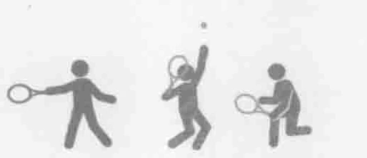
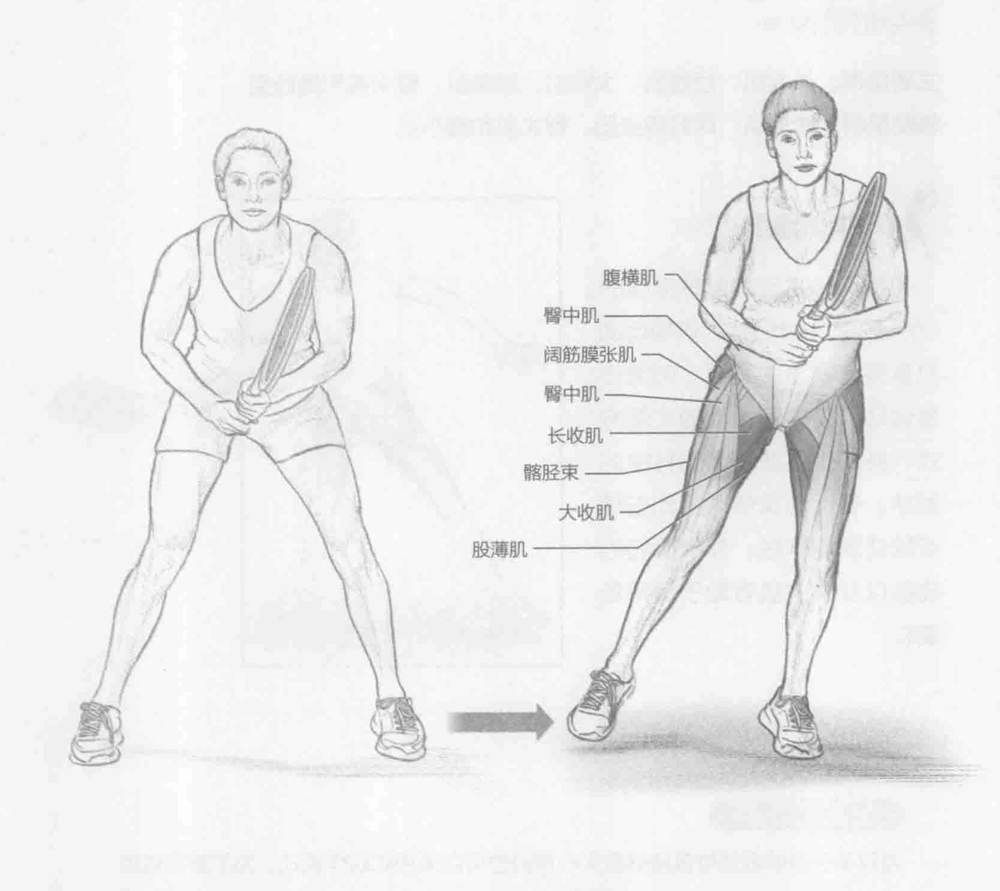
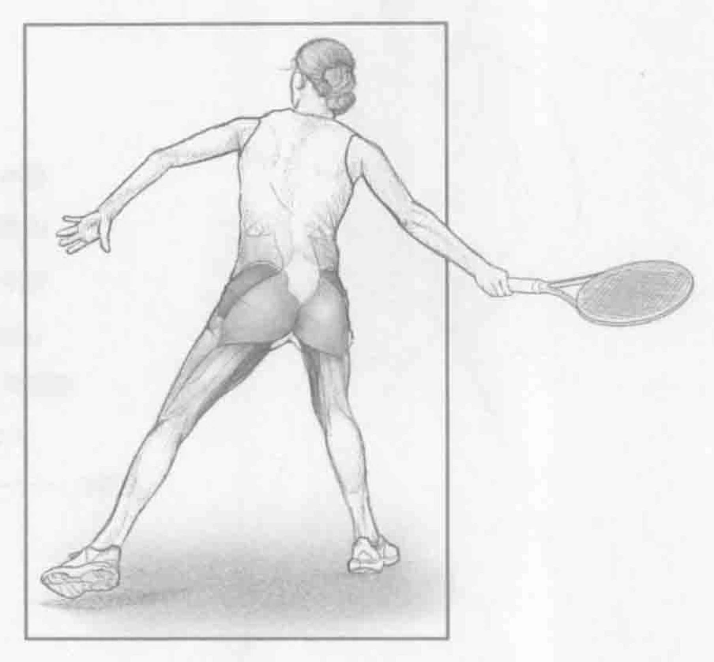

### 进行步骤

1. 保持运动姿势。双脚分开与肩同宽，双膝微弯，两眼直视前方。站在底线中间标识处，使用惯用手握拍。

2. 身体重心下移并保持平衡，向左移动五步。想要完成侧滑步，保持运动姿势，并拢双脚，双脚平行向侧面移动。

3. 向左移动五步之后，迈开外侧的左腿，然后移动回底线中间标识处。

4. 向右侧重复该动作。

### 参与的肌肉

主要肌群：长收肌、短收肌、大收肌、股薄肌、臀中肌和髂胫束

辅助肌群：腹横肌、阔肌膜张肌、臀大肌和臀小肌

### 网球训练要点

侧滑步占所有网球动作的60%到80%。因此，该项运动对赢得比赛至关重要。侧滑步是运动员接住落地球的主要方式，特别是接住连续对打中的发球。在运动员侧滑步到击球点接住落地球时，外展肌和内收肌以及臀中肌有助于保持低重心。

### 变化动作

#### 负重侧滑步

当双手于身前髋部位置持健身实心球时也可以采用此动作模式。为了增加难度，可伸直双臂。另一动作演变是穿着加重背心进行此动作。这增加了进行此动作所需的力量。
