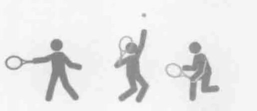
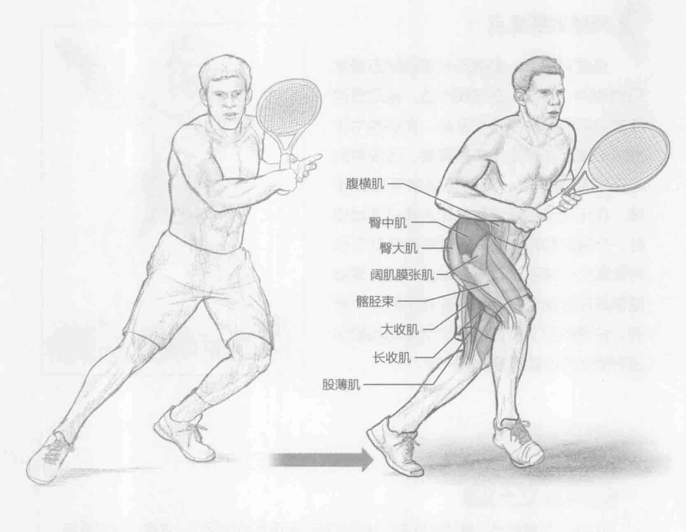
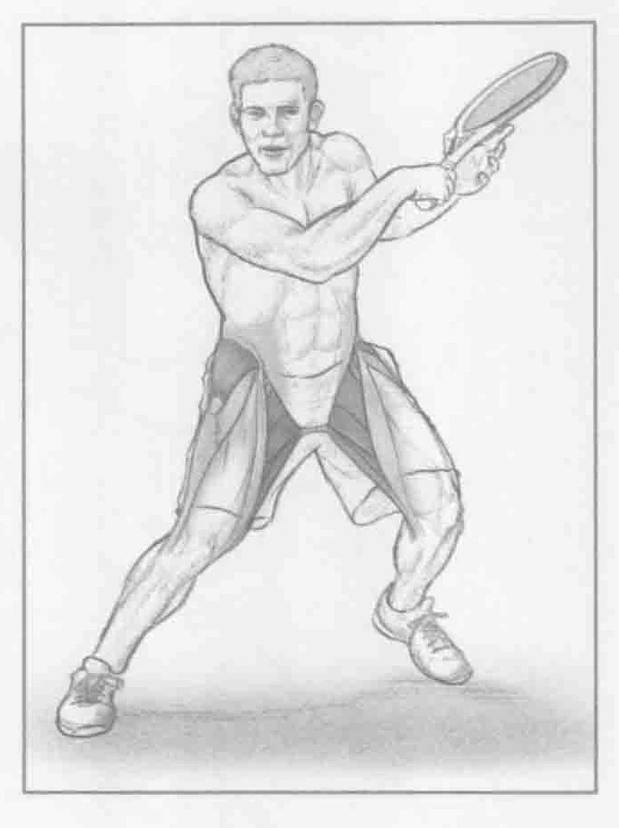

### 进行步骤

1. 保持运动姿势。双脚分开与肩同宽，双膝微弯，两眼直视前方。站在底线中间标识处，使用惯用手握拍。

2. 抬起右腿，右脚于左脚前交叉。双脚离地，左脚于右脚后面向左迈出。双膝微弯，挺胸。

3. 向底线中间标识处右侧重复该动作。确保改变方位后的第一步是交叉步。

### 参与的肌肉

主要肌群：长收肌、短收肌、大收肌、股薄肌、臀中肌和髂胫束

辅助肌群：腹横肌、阔肌膜张肌、臀大肌和臀小肌

### 网球训练要点

连续对打时，侧滑步是底线附近最常见的动作。通常，在底线附近，运动员改变方位后的第一步是交叉步。在训练中手握球拍重复这一动作非常重要。当没有时间限制和发球时，运动员经常采取此步法。在运动员侧滑步到击球点接住落地球时，外展肌和内收肌以及臀中肌有助于保持低重心。球手击打离身球后的回位速度通常是区分出色球手和一般球手的一个标志。快速的交叉步或还原步使运动员能够回到恰当的位置来击打下一球。

### 变化动作

#### 负重交叉侧滑步

当双手于身前髋部位置持健身实心球时也可以采用此动作模式。或者，当穿着加重背心时也可以采用此动作模式。这增加了进行此动作所需的力量。
