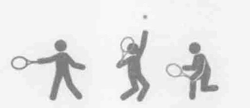
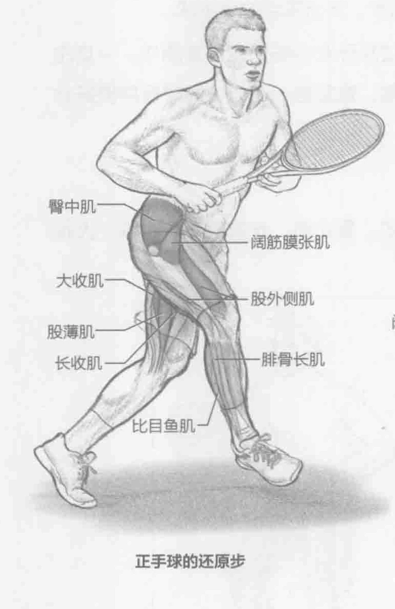
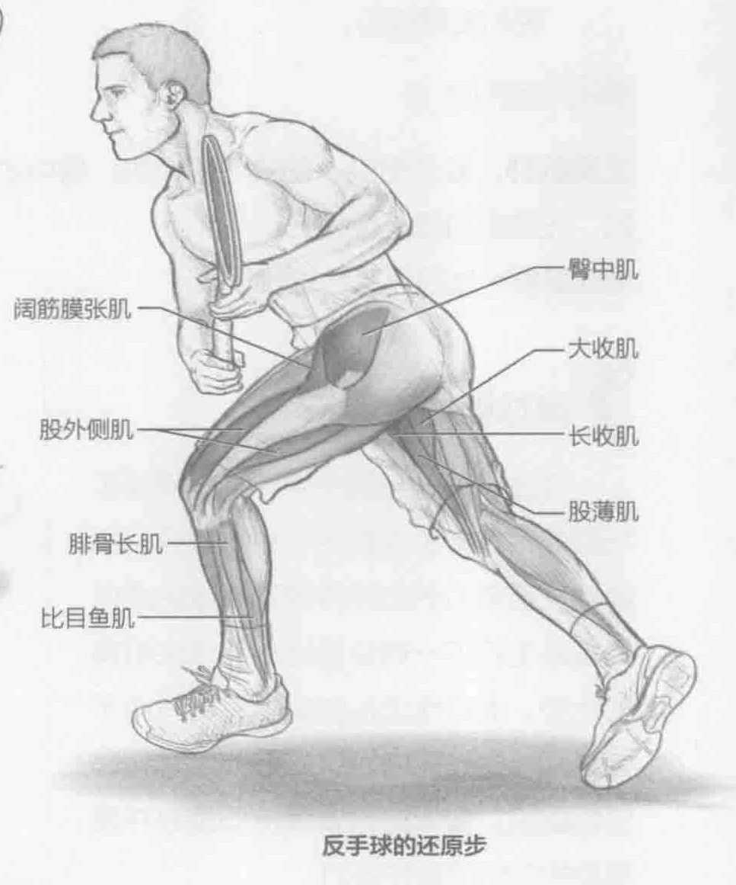
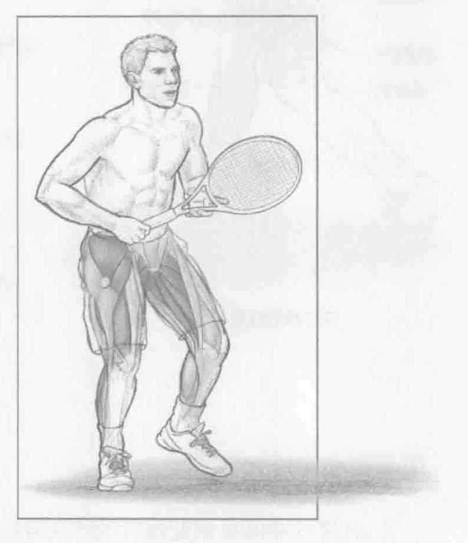

### 正手球的进行步骤

1. 在底线中间标识处保持运动姿势站立。用惯用手握拍。

2. 身体重心下移并保持平衡。向右迈出五步，击出完全的正手球。

3. 抬起外侧的右腿，右脚从左腿前面迈过从而在中场形成恢复动作。一旦右脚落在身体左侧，继续移动回起始位置。重复这一动作，同时保持良好站姿和击球技巧。

### 反手球的进行步骤

1. 向另一侧采取同样的动作来击出反手球。在底线中间标识处保持运动姿势站立。用惯用手握拍。

2. 身体重心下移并保持平衡。向左迈出五步，击出完全的反手球。

3. 抬起外侧的左腿，左脚从右腿前面迈过从而在中场形成恢复动作。一旦左脚落在身体右侧，继续移动回起始位置。重复这一动作，同时保持良好站姿和击球技巧。

### 参与的肌肉

主要肌群：股外侧肌、髂肌、腰大肌、臀中肌、臀小肌、长收肌、短收肌、大收肌、股薄肌和阔筋膜张肌

辅助肌群：比目鱼肌和腓骨长肌

### 网球训练要点

在击球后的还原步中，最佳网球手与其他网球手的区别在于步法部分。能够接住强有力的击球并返回有效的场内位置来击打下一球会给运动员带来明确的优势。此动作涉及的肌群包括有助于让腿靠近身体的内收肌、髋部屈肌和髋部内旋肌。重要的是要保持低重心并使蹬地的外侧腿强劲有力。

### 变化动作

#### 斜向回位

该项训练的斜向回位动作演变有助于充分锻炼网球动作。斜向回位动作（向斜前方和斜后方跑动）模拟向前跑动接住近位离身球和向后跑动接住远位离身球。对于大部分运动而言，最快的还原步是前交叉步。但是，如果想要回到中部底线的位置，运动员可能会使用后交叉步来接住近位离身球。
