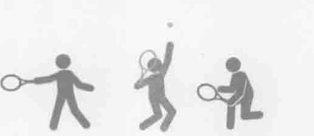
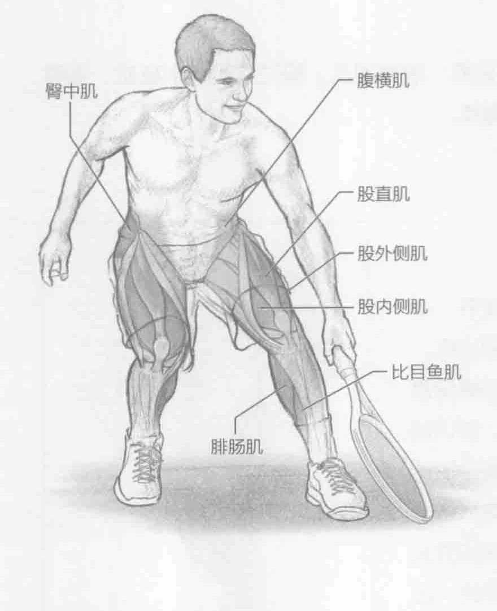
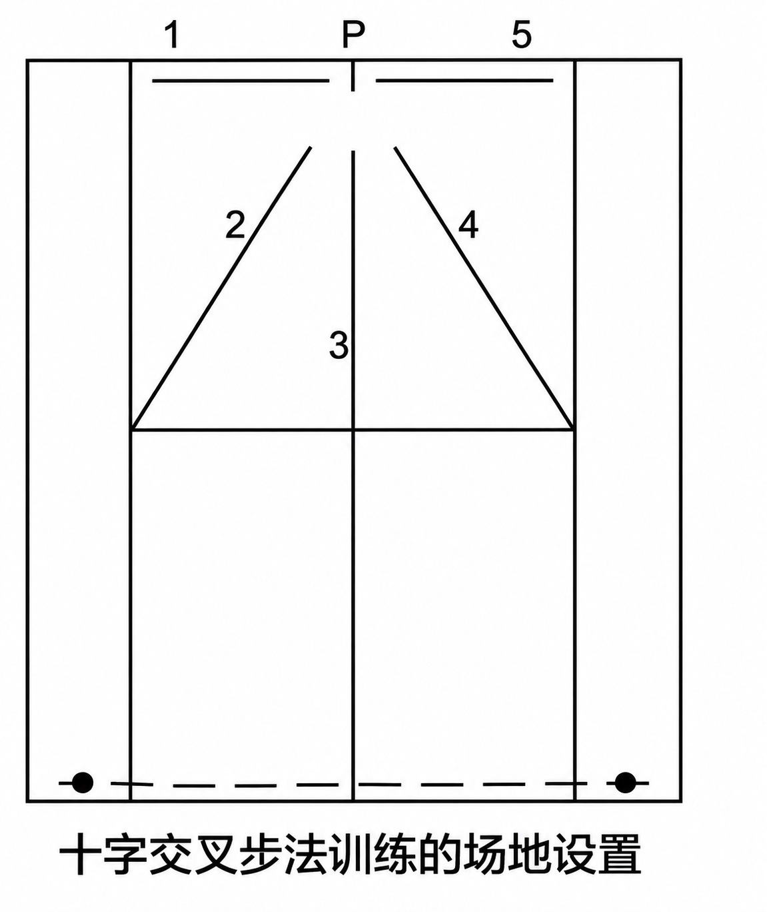
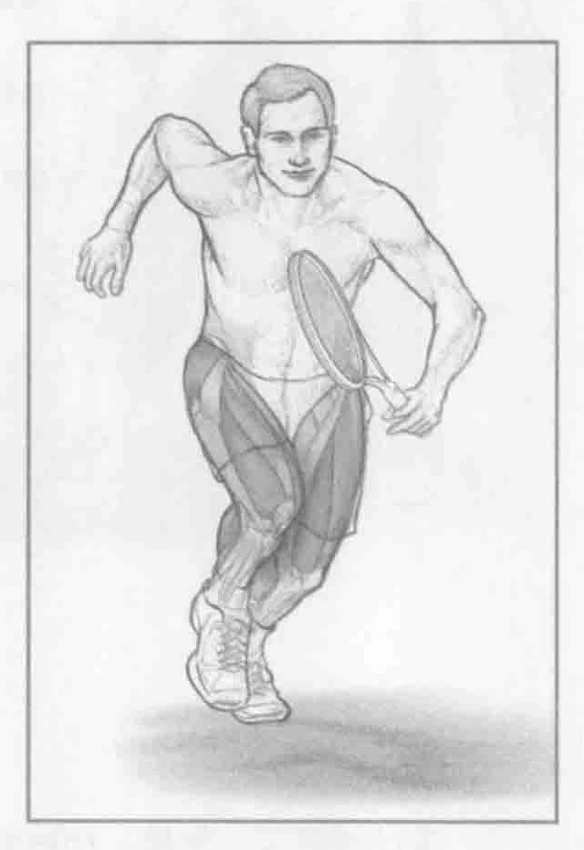

[查看这幅图的原截图](../../../media/tennis-system-training/figure-175-03-original.webp/)

### 进行步骤

1. 通常情况下，这是一项针对速度的训练。在底线中间标识处以运动姿势站立。无论是否手握球拍均可进行该项训练。从底线中间标识处冲向底线与右侧的单打边线形成的拐角处。用脚触及拐角处，然后返回并触及底线中间的标识处。

2. 冲向右侧的单打边线与发球线形成的拐角处。用脚触及拐角处，然后返回并触及底线中间的标识处。

3. 冲向T处。用脚触及T处，然后返回并触及底线中间的标识处。

4. 冲向左侧的单打边线与发球线形成的拐角处。用脚触及拐角处，然后返回并触及底线中间的标识处。

5. 冲向底线与左侧的单打边线形成的拐角处。用脚触及拐角处，然后返回并触及底线中间的标识处。

### 参与的肌肉

主要肌群：股直肌、股外侧肌、股内侧肌、股中间肌、股二头肌、半腱肌、半膜肌、臀大肌、臀中肌、腓肠肌和比目鱼肌

辅助肌群：腹横肌、竖脊肌和多裂肌

### 网球训练要点

在能够提升步法技巧的所有训练中，十字交叉步法训练可能是最与网球相关的训练。它包含各个方向的运动。此外，该项训练涵盖的距离与实际网球比赛中的距离一样。该项训练中的停步和起步模拟了实际网球比赛中的情况。在本项训练中，在从一个位置跑向另一个位置时要学会保持平衡。为了使这项训练更具有网球针对性，可以手握球拍进行此训练。运动员也可以加入不同的动作，比如侧向移动、滑步或后退。

### 变化动作

#### 捡球十字交叉步法训练

按照描述来进行该项训练。在每个位置捡起网球并将其带回到底线的中间标识处。除此之外，如果在该项训练中不进行计时，当到达每一个位置时，模拟击球。在右侧击出正手球，在左侧击出反手球或者每次转体时击球。
