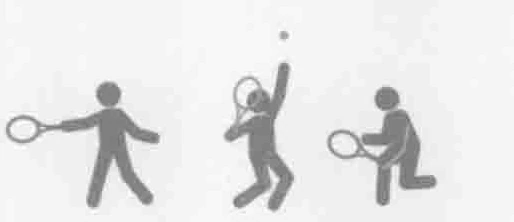
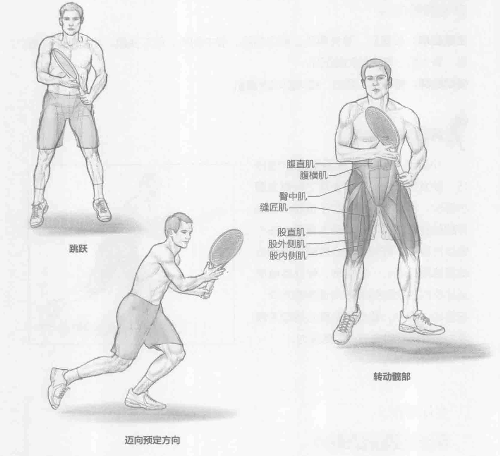
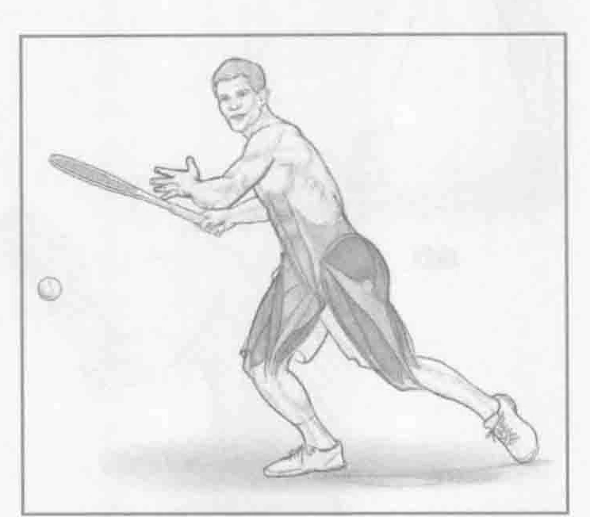

### 进行步骤

1. 保持运动姿势站立。双脚分开，与肩同宽。双膝微弯，两眼直视前方。站在底线中间的标识处，用惯用手握拍。

2. 向上跳起但不要跳得太高。在跳跃的最高处和落地的过程中，向预定方向转动髋部。这是一个简单的减重技巧。直跳直落，最靠近网球的脚稍微外转。

3. 一旦落地，向预定的最终方位迈出3或4步。另一侧重复该动作。

### 参与的肌肉

主要肌群：股直肌、股外侧肌、股内侧肌、股中间肌、股二头肌、半腱肌、半膜肌、臀大肌、臀中肌和缝匠肌

辅助肌群：腹横肌、髂肌、腰大肌和腹直肌

### 网球训练要点

小碎步是网球中最重要的步法技巧。除发球以外的任何击球之前都需要小碎步。小碎步的时机对于运动员占据好的位置来击打下一球至关重要。在小碎步过程中，髋伸肌向心收缩从而使运动员跳离地面。一旦落地，髋外旋肌使运动员的髋部和腿部转向预定的方向。在落地过程中，髋部屈肌离心运动来吸收力道并减轻对关节造成的压力。

### 变化动作

#### 应激式起跳小碎步

作为一个动作，小碎步并不十分复杂。但是，当加入不同的应激式起跳后，它可以变得更复杂。当需要响应对手的击球时，小碎步的时机十分重要。通常情况下，当对手开始向前挥拍时，就需要迈出小碎步。为了改进小碎步的时机，在训练过程中，让教练或搭档扔一个球来让你做出反应以便击球。
