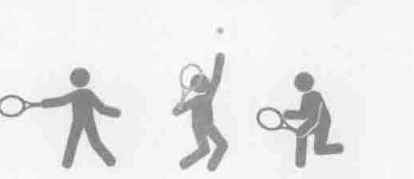
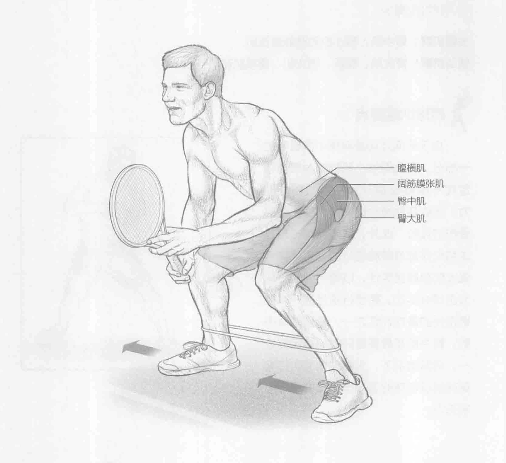
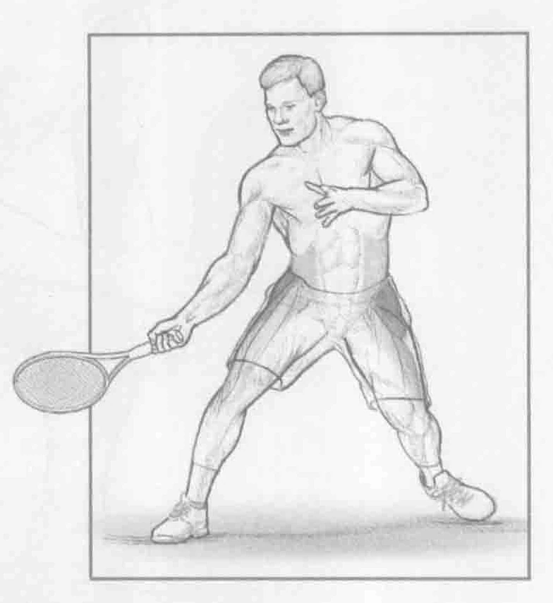
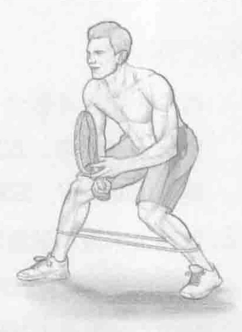

### 进行步骤

1. 两个小腿之间套上一个细橡皮筋。保持运动姿势站立。双脚分开，与肩同宽。双膝微弯。双眼直视前方。用惯用手握拍。开始时身体下压，以便大腿与地面平行，双膝弯曲大约90°。

2. 挺直上半身，膝盖弯曲大约90°。右腿向右跨出一小步，然后左腿向右跨出一小步。这样就回到开始的位置。

3. 换向右侧重复该动作，跨出5到10步。然后向左侧跨出5到10步。

### 参与的肌肉

主要肌群：臀中肌、臀小肌和阔筋膜张肌

辅助肌群：臀大肌、髂肌、腰大肌、腹横肌和竖脊肌

### 网球训练要点

由于侧向运动是网球中很重要的一部分，因此锻炼小肌群的力量与稳定性不仅能够提升运动员的移动能力，还能帮助减少髋部、大腿和腹部受伤的风险。此外，许多网球击球方法和动作都是单腿进行的，这就需要强大的单腿稳定性，以便将力量转化为击球或运动。跨步行走是提升单腿稳定性的最佳训练之一，特别是臀中肌。臀中肌是最重要的髋部稳定器之一。通常情况下，大部分试图击打离身球或远位球的运动员的臀中肌都比较无力。

### 变化动作

#### 斜向跨步行走

以斜向而非侧向的方式进行跨步行走。向前迈出大约45°。对角线方向使步伐更大，这能够调用以半开放式站位击打落地球和低位截击所涉及的肌群。

### 编者校对注

> 原书第175页：“换向右侧重复该动作，跨出5到10步。然后向左侧跨出5到10步。”。原扫描第二步已向右侧跨步，第三步仍写“换向右侧”，并非OCR误识；此处保留原书的方向文字，不自行改为另一侧。
