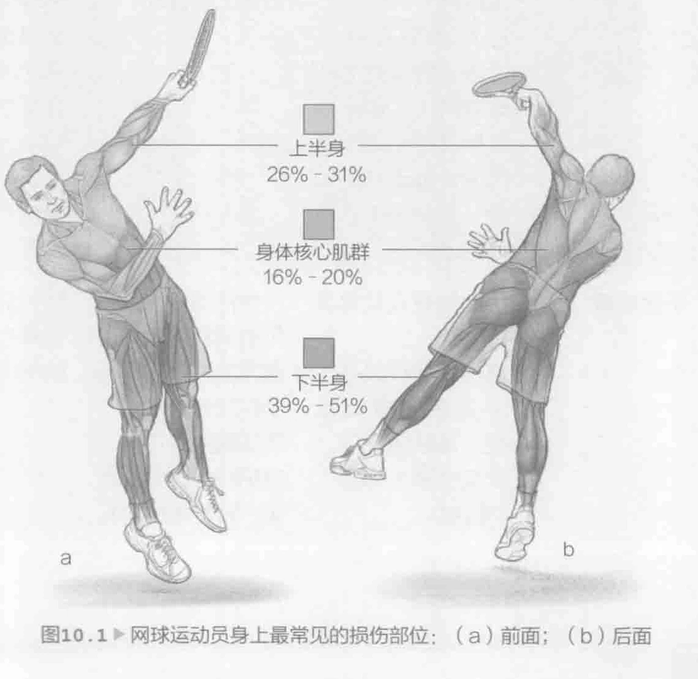

所有级别的网球运动员都希望提升他们在场上的技能。但是，预防运动损伤也同样重要。事实上，提升技能和预防运动损伤的训练是紧密相关的。虽然通常情况下，运动损伤的几率相对很小。但是，运动损伤可能并且确实发生在网球场上。有些运动损伤是急性的，比如脚踝扭伤。有些运动损伤是慢性的，比如持续性肩膀疼痛。无论在哪种情况下，我们可以通过制定和遵守适当的训练计划以及使用合适的器材来预防运动损伤。

### 选择合适的器材

想要选择合适的球拍，我们建议请教认证的网球教练。认证的网球教练可以根据球拍的长度、重量、重量分布、材质以及球拍线的类型及其张力来选择合适的球拍。

球拍的硬度各不相同。硬度大的球拍，虽然更有力，但是可能会带来过大的冲击力。较轻的球拍更容易操控但是吸收的冲击力较小。重的球拍更难以控制，从而有可能导致击球过晚。合格的教练能够指导您选择合适的器材。对于年轻的运动员或那些不是很强壮的运动员，认证网球教练还可以推荐合适的器材，以便他们有时间来逐渐习惯较大、较重的球拍。请教认证网球教练的另一个好处是，通过学习一些课程将有助于了解恰当的击球技巧，这也能减少运动损伤的次数。

除了根据比赛类型、比赛规模和比赛强度来选择合适的器材，还要考虑喜欢的球场。通常情况下，与硬地球场相比，红土球场和草地球场对身体条件的要求相对宽松。但是，红土球场要求髋部和腿部具有更大的力量和灵活性，因为需要使用滑步来接球。在大部分体育用品商店和网球俱乐部都可以买到制鞋企业针对特定球场生产的鞋子。除了缓冲效果外，选择一双好的网球鞋关键还在于确保其能提供足够的侧面支撑。体育用品商店中的专业店员或认证网球教练应该能够根据比赛、体型和球场表面材质推荐合适的网球鞋。

最后，因为经常在温暖的环境中打网球，所以一定要穿着浅色、宽松的衣服。帽子或遮阳帽能够遮阳。涂抹防晒霜，以及在打球之前、打球时和打球之后补水能预防很多问题以及与热相关的疾病。

### 构建身体平衡

网球是一种自下而上的运动。通过蹬地形成力量，然后力量通过身体转移到球拍。这种力量转移系统被称之为动力链或运动链。所有部分依次运动以帮助击出球。

因为这些力量由下而上进行转移，所以力量转移的好坏都将影响从脚踝到手腕和手指的肌群、关节、韧带和肌腱。这也清楚地表明需要平衡下半身和上半身的力量与灵活性。同样重要的是身体前面和后面以及左侧和右侧的平衡。形成这种平衡可能并不容易，因为网球是一个稍微侧重某一方面的运动。在网球运动中，将会更多地利用惯用侧，特别是上半身。此外，通常情况下，在击球过程中，上半身的肌群在前胸多做向心运动，而在后背多做离心运动。精心设计的训练计划能够帮助克服许多潜在的不平衡性。

研究表明下半身左右侧在力量和灵活性方面都没有太大的差异。这对预防和治疗下半身的运动损伤是优势。因为发球而使得单腿落地的次数增多，所以有时运动员发球时的落地腿（右手发球人使用左腿落地）更强壮。

通常情况下，上半身的力量和灵活性的差异存在于惯用侧和非惯用侧以及前胸和后背之间。由于运动本身的性质，因此实现身体前面和后面或左侧和右侧的真正平衡几乎是不可能的。但是我们可以在训练和运动损伤复原过程中努力做到这一点。既然可靠训练计划的重点是努力实现肌肉平衡，那么可以考虑请教在这方面已取得认证的专家，比如力量和体能训练专家，来帮助预防多种运动损伤并使自己发挥最大的潜力。

### 预防网球运动损伤

有关网球运动损伤发病率的评论表明，网球受伤率相对较低。运动员在场上训练或比赛1000小时，就有可能受到2到20次伤害。这相当于在千分之二到百分之二的训练时间内会受伤（W.B. Kibler和M. Safran，2005年，“Tennis Injuries,” Medicine and Sport Science, 48: 120–137）。与其他运动相比，这是一个十分低的受伤率。但是，网球运动依然存在运动损伤，其中的许多运动损伤是由于准备或训练不足造成的。

关节损伤是最常见的网球运动损伤。预防关节损伤的关键在于确保周围的肌群及相关韧带与肌腱强壮、灵活。这也与平衡有关。当然，急性运动损伤（比如脚踝扭伤或由于冲撞球网或网柱造成的擦伤）经常发生，但适当的训练有助于预防许多慢性损伤。通常情况下，网球中的慢性损伤属于过度使用性损伤。

大部分网球击球都以一种重复性的模式击出，这就导致过度使用性损伤（第180页，表10.1）。网球运动中最常见的过度使用性损伤发生在肩部、肘部、下背部和腹肌、膝盖和髋部。肩部损伤是由于数千次发球或超时击打落地球。肘弯损伤通常与不合适的技巧或器材有关。下背部和腹肌是由于长时间扭曲和转动以及以开放式站位击球而受伤。膝盖和髋部损伤是由网球运动的停步和起步性质造成的。除此之外，由于经常在硬球场打球和在比赛中经常变换方位，因此小腿和脚部也会受到损伤。小腿和脚部最常见的损伤包括小腿扭伤、胫骨骨膜炎和足底筋膜炎。如您所见，所有身体部位都可能出现运动损伤。按照先前章节中介绍的训练进行锻炼有助于提供平衡的训练方法。关键在于强化每个关节周围的肌群来预防运动损伤。图10.1列出了网球运动员身上最常见的损伤部位。

## 表10.1 网球常见的过度使用性损伤

### 旋转袖撞击综合症

**身体部位：**肩部。

**症状：**做过顶动作或提重物时有痛感。

**原因：**肌肉疲劳。不正确的技巧，特别是在收缩旋转袖肌腱的过头动作中使用的技巧。

**预防和治疗：**使用包含本章训练在内的恰当强化和伸展训练。用正确的技巧打球。强化肩部和上背部的肌群。

### 肌腱炎

**身体部位：**肩部。

**症状：**后旋转袖肌肉和肌腱部位有痛感。肩部前面的疼痛可能与二头肌腱的肌腱炎有关。

**原因：**由于肩关节受力而过度用力，特别是在击打落地球和发球的随球动作中，导致重复性的肌腱轻伤。

**预防和治疗：**预防旋转袖撞击综合症的训练也能预防肌腱炎。

### 肘部上髁炎

**身体部位：**肘部。

**症状：**肘部外侧有痛感（肱骨外上髁炎或网球肘）。肘部内侧有痛感（内上髁炎或高尔夫球肘）。内上髁炎涉及正手球和发球时伸展手腕的肌腱，更常见于有技巧的运动员。

**原因：**不正确的反手球技巧。反手击球过晚。

**预防和治疗：**参加网球课程以确保拥有正确的击球技巧。用轻重量强化前臂的屈肌和伸肌。伸展前臂的屈肌和伸肌。

### 手腕疼痛

**身体部位：**手腕。

**症状：**手腕桡骨或尺骨侧有痛感。桡侧偏移疼痛并不常见于网球运动员。通常情况下，涉及桡侧（拇指）的肌腱。

**原因：**尺侧疼痛可能是由尺侧偏移引起的，通常发生在双手反手球加速之前。不正确的技巧。球拍较硬。握拍太紧。强有力的击球。

**预防和治疗：**预防肘部损伤的训练也能预防手腕损伤。

### 下背部扭伤

**身体部位：**下背部。

**症状：**由于突然、出乎意料的移动或在一场或一系列有很多停步和起步动作的长时间比赛中过度使用而造成下背部有痛感。

**原因：**躯体力量不足以满足转体的高要求，特别是在已开放式站位击打落地球时。

**预防和治疗：**正确地伸展和强化下背部肌群、腘绳肌和深层髋部回旋肌。

### 腹部扭伤或腹部肌肉拉伤

**身体部位：**腹肌。

**症状：**腹部有痛感，特别是在击打高球或伸手接住离身球时。

**原因：**开放式站位击打落地球时不断进行转体。高速发球。

**预防和治疗：**强化腹部肌群、下背部肌群和腹斜肌的训练。

### 膝盖疼痛

**身体部位：**膝盖。

**症状：**膝盖骨后面或周围有刺激或痛感。

**原因：**缺乏膝盖周围肌群的力量或支撑。没有这种肌肉支撑，膝盖骨不能恰当地在股骨末端的股槽中滑动。

**预防和治疗：**膝关节支具有助于支撑膝盖。但是强化股四头肌肌群以及扩大他们的运动范围是最有效的方式。避免进行超过90°弯曲的训练，比如深蹲。

### 髋屈肌扭伤

**身体部位：**髋部。

**症状：**场上难以移动。髋部有痛感或不适。

**原因：**以开放式站位击打落地球。经常变化方位。腘绳肌和股四头肌绷紧。

**预防和治疗：**开发髋部良好的灵活性。强化和伸展腘绳肌、股四头肌和下背部。每天进行伸展训练。

### 小腿肌肉扭伤或网球腿

**身体部位：**小腿。

**症状：**腓肠肌内侧有痛感，感觉像有人将球打在腿上。

**原因：**过度使用。经常用前脚落地。

**预防和治疗：**伸展和强化腓肠肌和比目鱼肌。受伤后，不要太快地冲回去比赛。如果不能很好地治愈，该损伤有可能复发。

### 胫骨痛

**身体部位：**小腿。

**症状：**胫骨前端有痛感。

**原因：**小腿肌肉或骨骼上的纤维组织有慢性炎症。改变球场表面材质。严重内翻。常见于正经历生长突进期的年轻运动员。

**预防和治疗：**休息。避免引起疼痛的活动。伸展和强化肌肉。矫正器可能有助于康复并预防该损伤复发。

### 足底筋膜炎

**身体部位：**脚部。

**症状：**脚跟前面的足底有痛感。通常情况下，当脚部受力以及早晨刚站起来时，痛感最厉害。通常情况下，活动脚趾或掰起脚趾也会造成强烈的痛感。

**原因：**病因尚未明确，但可能与运动中的落地过程有关。在足跖屈，脚趾强制进行过度伸展，这使得跖腱膜的张力达到最大。

**预防和治疗：**进行伸展训练并穿着矫正器以便康复。受伤后或感觉到疼痛时，立即休息。穿着脚跟杯来缓冲落地时对脚跟造成的冲击。

在本章中接下来的部分，我们列出了一些最相关的训练和伸展训练来预防常见的网球运动损伤。与运动损伤预防相关的力量训练每隔一天进行一次，以让身体能够休息一天。如果日程允许，每天都要进行灵活性训练。当肌群兴奋时，灵活性训练的好处最大，所以可以考虑在训练或比赛结束后进行灵活性训练。
