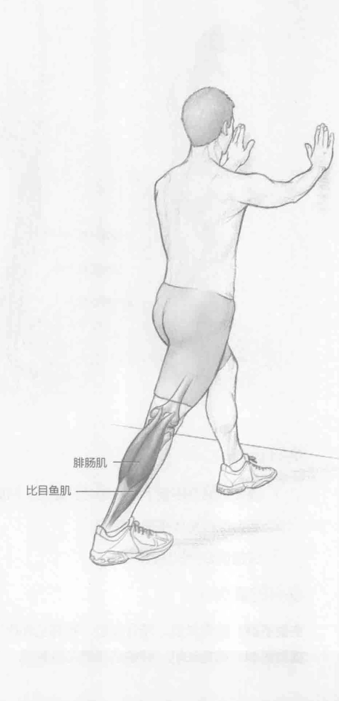

### 进行步骤

1. 双手扶墙，挺胸，保持重心稳定。

2. 向后伸直右腿，膝盖绷直，以便伸展右小腿。确保右脚跟触地。

3. 保持该伸展动作15到30秒。

4. 换另一条腿来重复该动作。

### 参与的肌肉

主要肌群：腓肠肌和比目鱼肌

辅助肌群：腘肌

### 网球训练要点

许多网球运动员会感到小腿疼痛或不适。在许多情况下，缺乏适当的活动会造成小腿运动损伤。缺乏适当的运动还会限制场上的表现，因为小腿的两大肌群（腓肠肌和比目鱼肌）是将力量从地面向上传递给网球的整个动力链的第一站。如果运动员绝大部分在硬球场上打球，他们的小腿更容易疼痛或有紧绷感。当运动员从红土球场或草地球场转移到硬球场打球时，他们通常也会抱怨小腿疼痛。

