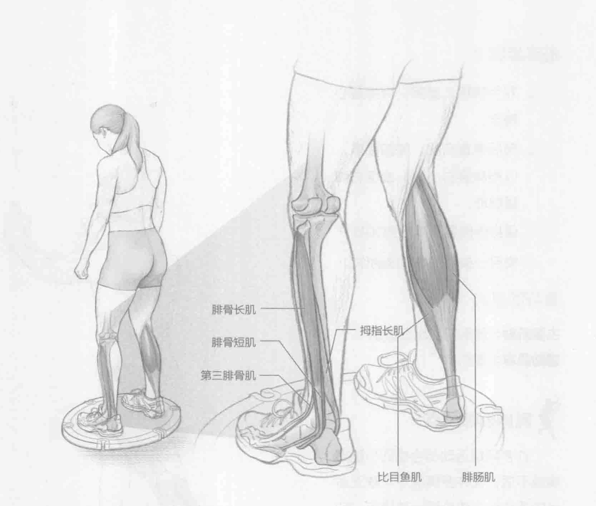

### 进行步骤

1. 慢慢地站在摇板上。双脚分开站立，与肩齐宽。腹部收紧，挺胸。

2. 努力保持身体平衡、稳定。

3. 保持该姿势30到60秒。

### 参与的肌肉

主要肌群：腓骨长肌、腓骨短肌、腓肠肌和比目鱼肌

辅助肌群：拇指长肌、胫前肌和第三腓骨肌

### 网球训练要点

此训练有助于开发下半身的肌肉运动知觉或身体知觉并且能够直接加强网球运动员的平衡性。平衡性在球场上很重要，因为大部分击球和运动是在传统意义上不稳定的环境中完成的，比如单腿姿势。运动员具有的身体知觉越多，他/她就越能将力量转化为击球，从而形成更大的球速。更强的身体知觉同样有益于减少运动损伤发生的可能性，特别是下半身的运动损伤。

### 变化动作

#### 凹凸不平表面的站立平衡

此训练有多种变化形式。可以单腿进行此训练，同时手持健身实心球或哑铃，甚至是蒙着眼镜。所有的这些变化形式都增加了此训练的难度，并且它们都是用来提升网球运动员肌肉运动知觉和平衡性的渐进式训练。
