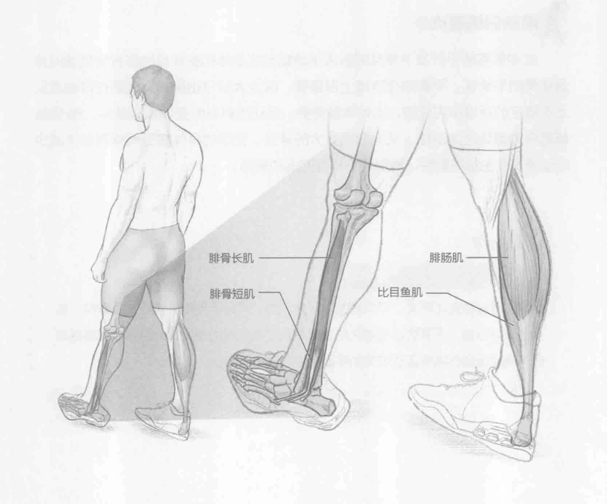

### 进行步骤

1. 双脚分开站立，与肩齐宽。转移身体力量，这样就可以用脚掌保持平衡。

2. 左脚向前迈一步，然后右脚向前迈一步。

3. 重复该动作。双脚交替前行直至每只脚都迈出五步。

### 参与的肌肉

主要肌群：腓骨长肌和腓骨短肌

辅助肌群：腓肠肌和比目鱼肌

### 网球训练要点

由于快速改变方位和在比赛中踝关节承受的大量力道，因此网球运动常出现踝关节损伤。侧脚踝行走是一种很好的方式，可强化脚踝部位肌群、韧带和肌腱。强化这些脚踝组织结构也有助于预防内翻脚踝扭伤。内翻脚踝扭伤是网球运动中最常见的一种踝关节运动损伤。当踝关节翻到脚部外面或侧面就产生内翻脚踝扭伤。它通常导致距腓韧带受损。如果是更严重的扭伤，也会导致跟腓韧带受损。脚踝扭伤是急性运动损伤。当运动员跑着接离身球或快速、用力地改变方位时，容易造成脚踝扭伤。包括侧脚踝行走在内的日常训练有助于强化脚踝，这样可以减少踝关节运动损伤的发生。
