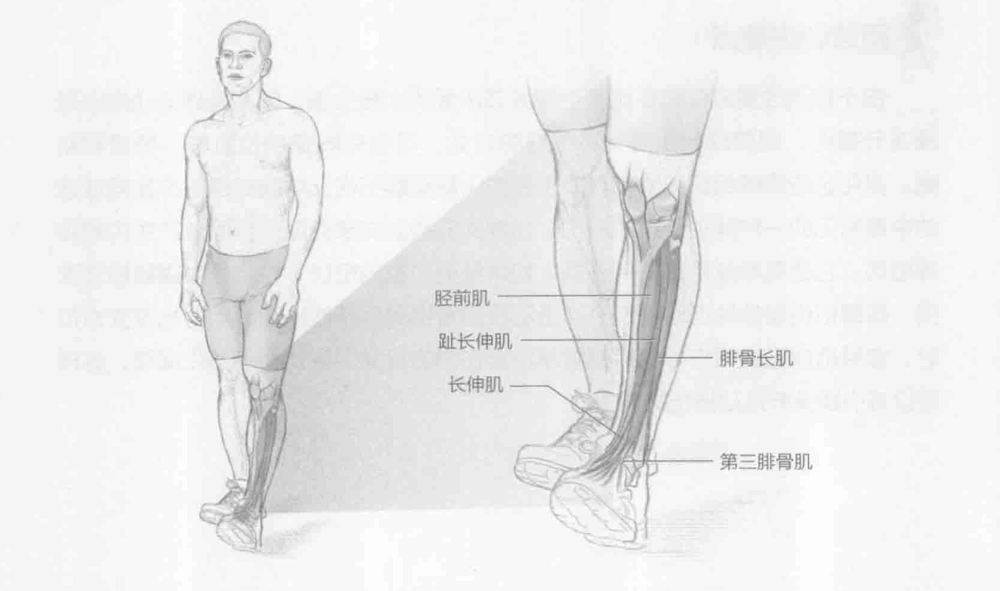

### 进行步骤

1. 双脚分开站立，与肩齐宽。

2. 左脚脚后跟向前迈一步。脚趾离地，脚尖绷直。右脚脚后跟向前迈一步，脚趾离地，脚尖绷直。

3. 重复该动作。双脚交替前行直至每只脚都迈出五步。

### 参与的肌肉

主要肌群：胫前肌、趾长伸肌、长伸肌、腓骨长肌和第三腓骨肌

### 网球训练要点

脚后跟行走开发脚踝周围的肌群、韧带和肌腱的力量。但是，脚后跟行走最大的好处在于它强化了胫前肌，这有助于限制胫骨痛和与胫骨相关的疼痛的发生。这是一个十分重要的训练，尤其是对那些脚踝力量有限和承受胫骨相关疼痛的运动员而言。
