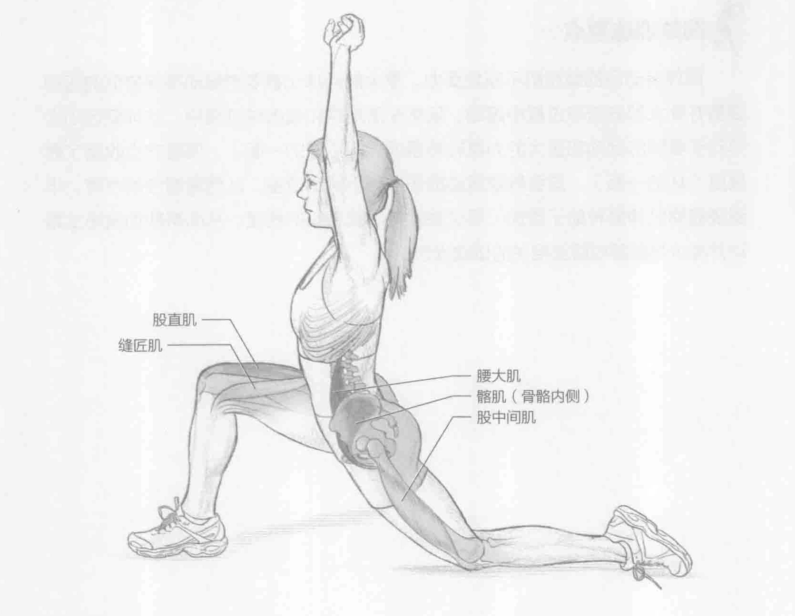

### 进行步骤

1. 左膝跪地（或跪在坐垫、毛巾或垫子上来减少膝盖扭伤）。右脚向前迈一步，呈弓步，右膝弯曲90°。双臂举过头顶，肘弯伸直，双手相握。

2. 慢慢地向前推动左髋来伸展左髋屈肌。确保右膝不会超过右脚的位置。

3. 保持该伸展姿势15到30秒。

4. 换另一条腿重复该动作。

### 参与的肌肉

主要肌群：髂肌、腰大肌和股直肌

辅助肌群：股中间肌和缝匠肌

### 网球训练要点

网球运动员的髋屈肌不断地受力。重大的网球比赛要求运动员保持低的运动姿势并在大部分击球过程中跑动。虽然在落地球和截击球过程中，这种低运动姿势对于更快的跑动和更大的力量转移是理想的（好的一面），但是它也收缩了髋屈肌（坏的一面）。这会导致运动损伤并减小活动范围，从而限制技能发挥。半跪姿髋屈肌伸展有助于增加（至少是保持）髋屈肌的长度，从而帮助加强场上跑动并减少与髋部或腹部相关的运动损伤。
