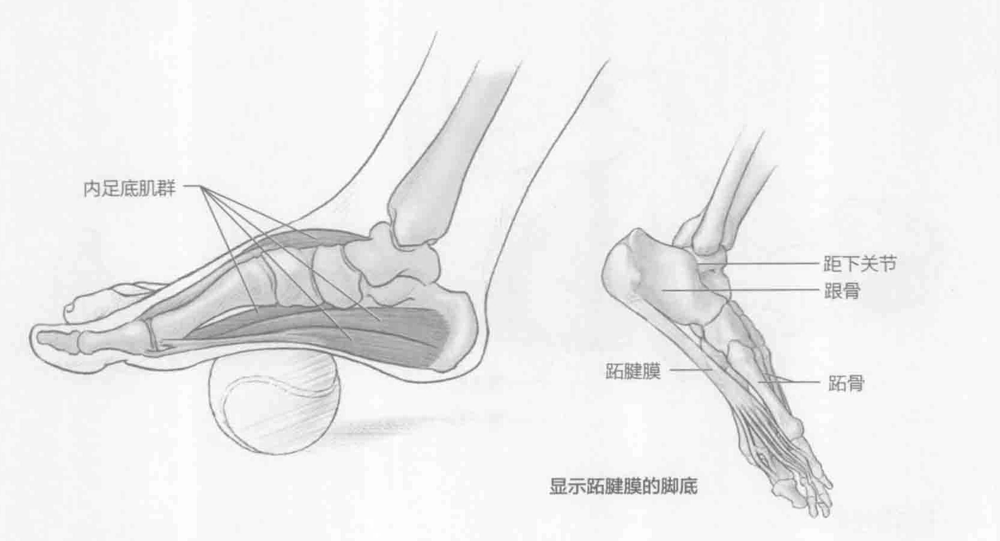

### 进行步骤

1. 坐在长凳或椅子上。光脚踩在网球上。网球在脚心下。

2. 慢慢地向前、向后移动脚部，以一种画圈的方式按摩脚底30秒或直至感到疼痛或紧绷感减轻。

3. 换另一只脚重复该动作。

### 参与的肌肉

主要肌群：内足底肌群

### 网球训练要点

与其说网球按摩是一项训练，不如说它是一种康复技术。它会使足底放松，减少因过多地与地面摩擦和网球训练与比赛中所需的方位改变而造成的足部紧绷感。它也是一个很好的技巧，用来减少脚后跟和中足的紧绷感。此外，它能够缓解足底筋膜炎造成的疼痛。跖腱膜足底的深筋膜，其源自跟骨结向远端行至各足趾的近节趾骨。
