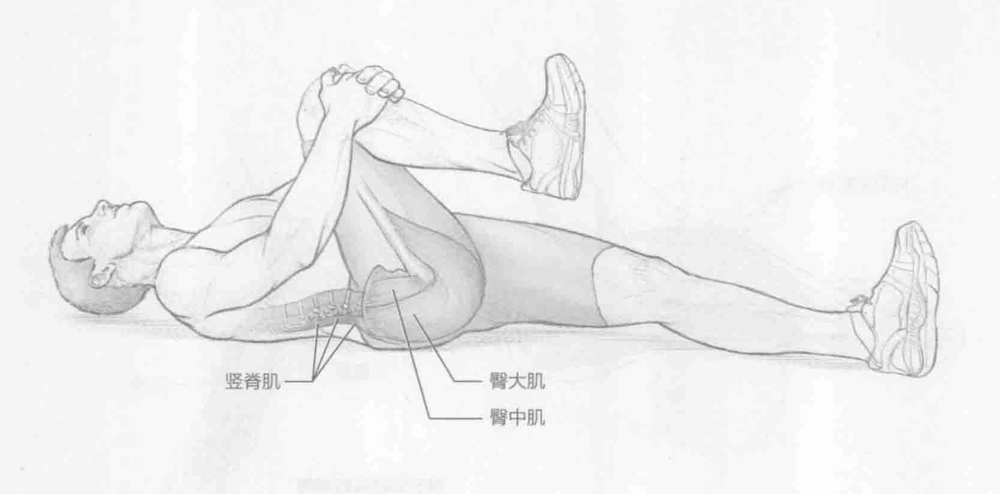

### 进行步骤

1. 仰卧在地板或垫子上。放松双肩。完全伸直双腿和双脚，脚尖绷直。

2. 双手握住右腿膝盖下方。膝盖弯曲，将右腿蜷向胸部。

3. 保持该伸展姿势15到30秒。

4. 回到起始位置。换另一条腿重复该动作。

### 参与的肌肉

主要肌群：竖脊肌和多裂肌

辅助肌群：臀大肌和臀中肌

### 网球训练要点

对于网球运动员而言，下背部是全身最容易受伤的部位之一。虽然很多事情都会导致运动损伤，但下背部缺乏灵活性可能是一个诱发因素。仰卧抱膝伸展是一项很好的训练，用来提升下背部的灵活性。针对下背部的结构化强化训练在将来可以很大程度地减少下背部受伤的几率。第5章和第6章的训练也强化了背部和核心部位的肌群。
