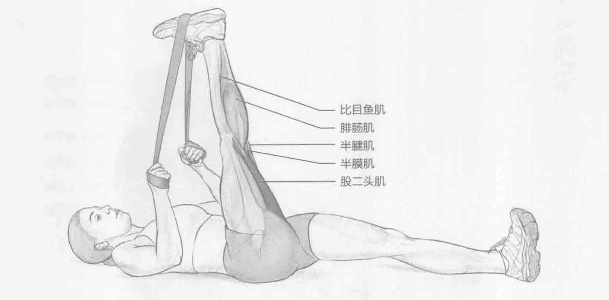

### 进行步骤

1. 仰卧在地板上，肩部靠地。双腿伸直，脚尖绷直。将弹力带、绳索或毛巾搭在右脚上。

2. 拉弹力带的两端使右腿笔直抬起。

3. 在最高点保持该伸展姿势15到30秒。

4. 回到起始位置。换另一条腿重复该动作。

### 参与的肌肉

主要肌群：股二头肌、半腱肌和半膜肌

辅助肌群：腘肌、腓肠肌和比目鱼肌

### 网球训练要点

在场上运动时，腘绳肌（股二头肌、半腱肌和半膜肌）在髋部伸展方面发挥重大作用，并且它与改变方位时的减速运动密切相关。腘绳肌群是运动员身上容易紧绷的部位之一。腘绳肌紧绷和下背部疼痛有一定的关系。加强腘绳肌灵活性将减少下背部运动损伤并提升场上表现。
