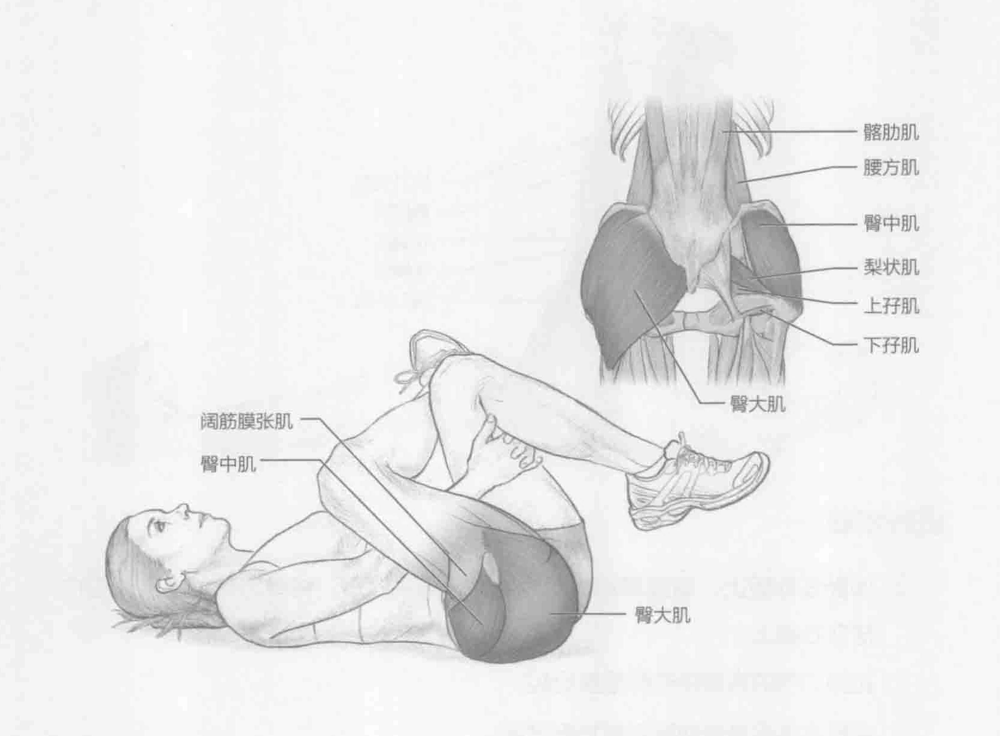

### 进行步骤

1. 仰卧在地板上。将右侧踝骨（脚踝外侧的骨头）放在左侧股四头肌处，略高于左膝。

2. 将右手放在两腿之间，左手环抱左腿。

3. 双手向后拉左腿来加大腘绳肌的伸展。

4. 保持该伸展姿势15到30秒。

5. 回到起始位置。换另一条腿重复该动作。

### 参与的肌肉

主要肌群：臀大肌、梨状肌和臀中肌

辅助肌群：髂肋肌、腰方肌、上孖肌、下孖肌、阔筋膜张肌和缝匠肌

### 网球训练要点

由于在网球运动中需要将力量转化为击球并保持低重心，因此运动员臀部的

主要肌群承受压力的很大。这些肌群在整个训练或比赛过程中需绷紧。因此，这些肌群保持最佳长度很重要。这将使髋部能够完全旋转，力量也能通过动力链从地面向上有效地进行转移，并且最终将力量有效地转移给网球。
