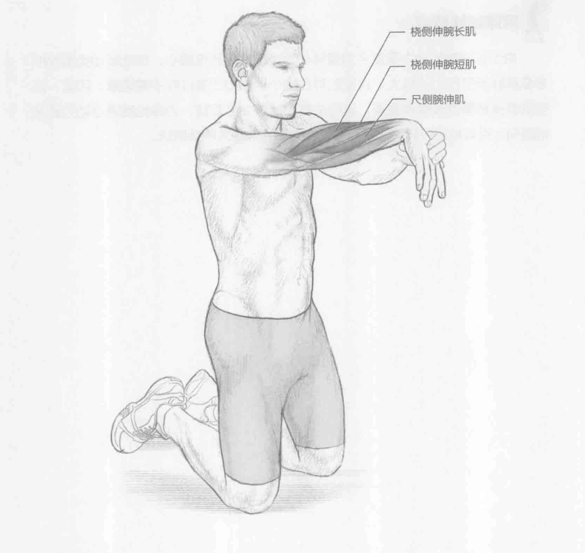

### 进行步骤

1. 可以跪着（如图所示）、站着或坐着来进行此训练。将右手掌于身前朝下，手臂于胸前伸出，与肩同高。

2. 用左手轻推右手来加大拉伸。

3. 保持该伸展姿势15到30秒。

4. 换另一条胳膊重复此动作。

### 参与的肌肉

主要肌群：尺侧腕伸肌、桡侧伸腕长肌和桡侧伸腕短肌

### 网球训练要点

对于大部分击球而言，前臂伸肌的灵活性非常重要。但是它直接影响反手击打落地球时向后挥拍的质量。活动功能范围越大，就越能够存储潜在的能量。这些潜在的能力可以在击打落地球的加速过程中释放出来。
