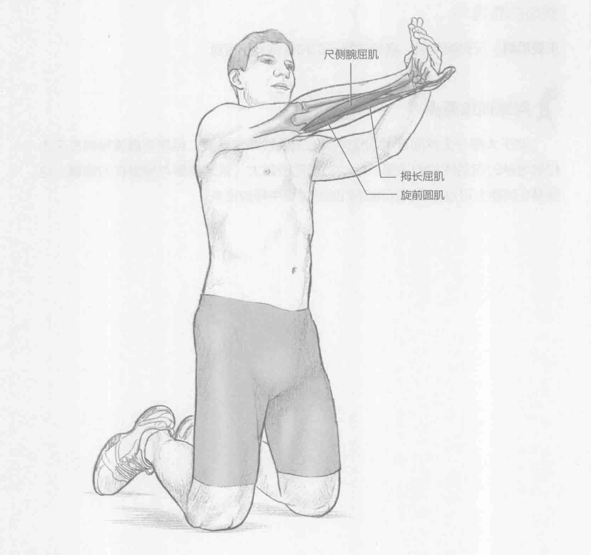

### 进行步骤

1. 可以跪着（如图所示）、站着或坐着来进行此项训练。将右手掌于身前朝下，手臂于胸前伸出，与肩同高。举起手指，指尖朝上。

2. 用左手将手腕轻轻地向后拉来加大拉伸。

3. 保持该伸展姿势15到30秒。

4. 换另一条胳膊重复此动作。

### 参与的肌肉

主要肌群：尺侧腕屈肌、拇长屈肌和旋前圆肌

### 网球训练要点

我们不能低估前臂屈肌适当灵活性的重要性。前臂屈肌的适当灵活性对有效的击球十分重要，因为前臂屈肌是将力量转移给接触球的最后一个身体部位。灵活性较差的运动员的活动范围有限，这限制了击球技巧，从而使力量爆发和场上表现欠佳。此外，较小的活动范围使运动员的上臂和肩部容易出现问题，这也会导致运动损伤。
