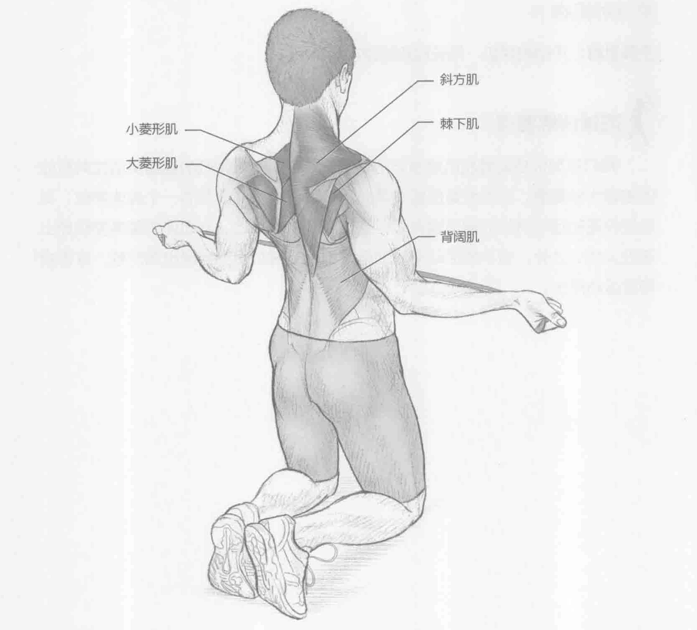

### 进行步骤

1. 跪在地板（或坐垫）上，如图所示，或采取站姿。双手握住一条弹力管或弹力带，掌心向上，肘部弯曲，双肩向后下方倾斜，头部和颈部放松，保持重心稳定。

2. 向外旋转双手2到3英寸（约5到8厘米），同时将拇指外转。然后收紧肩胛骨。保持该姿势2到3秒。在收紧肩部的同时挺胸。

3. 慢慢地回到起始位置。

### 参与的肌肉

主要肌群：斜方肌、棘下肌、大菱形肌和小菱形肌

辅助肌群：背阔肌

### 网球训练要点

由于许多过度使用性运动损伤发生在肩关节，因此强化旋转袖和肩胛稳定肌非常重要。这些肌群经常离心运动，特别是在发球和正手球的随球动作阶段。此训练通过使肌群朝反方向运动（向心运动）来提升肩胛带的完整性。此外，这项训练有助于保持恰当的姿势。由于动作具有重复性，因此姿势也是很多网球运动员关注的事情。
